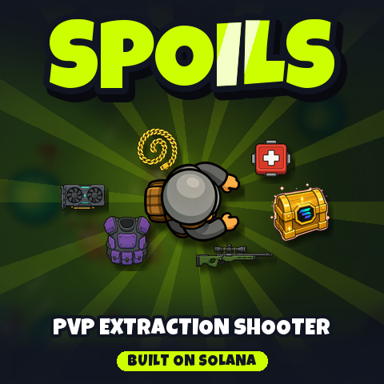
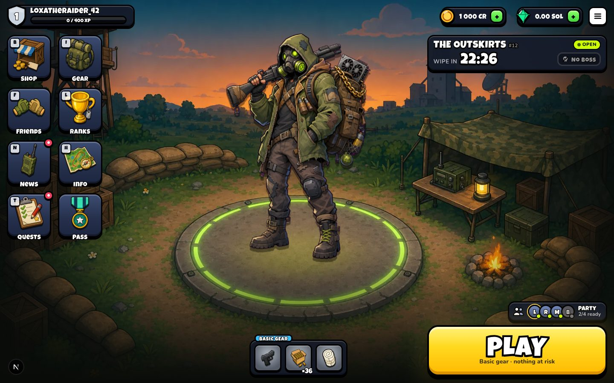
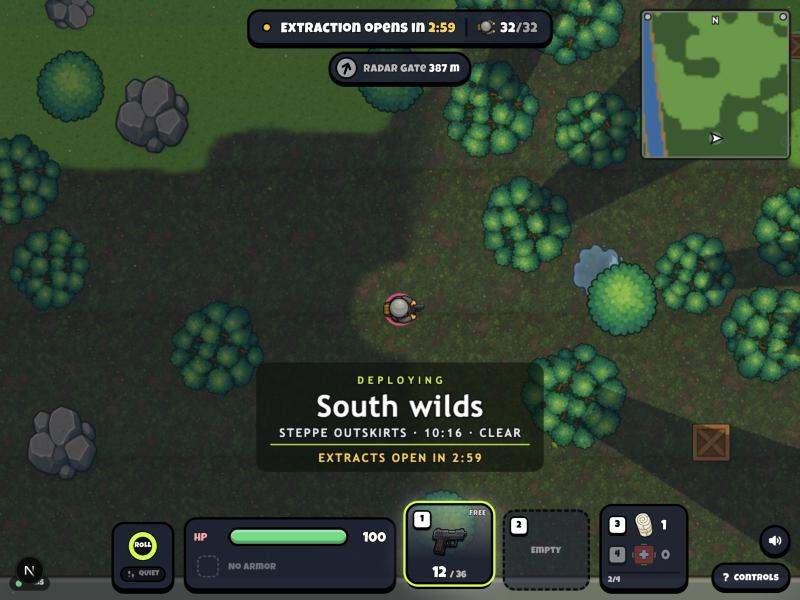
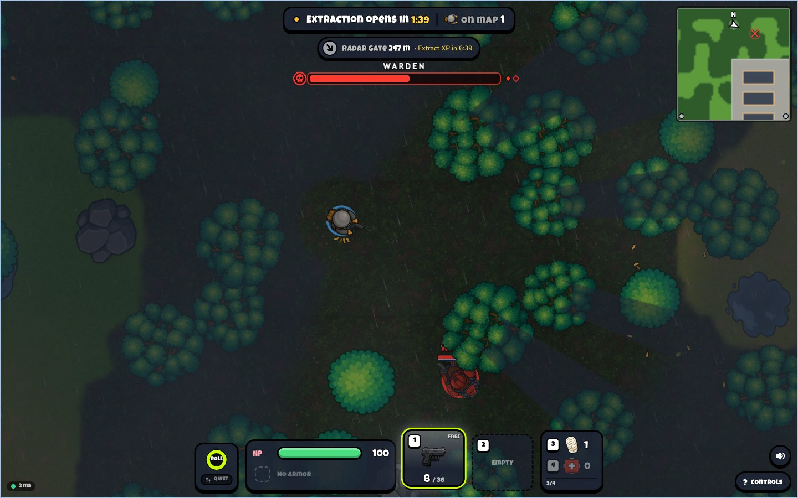
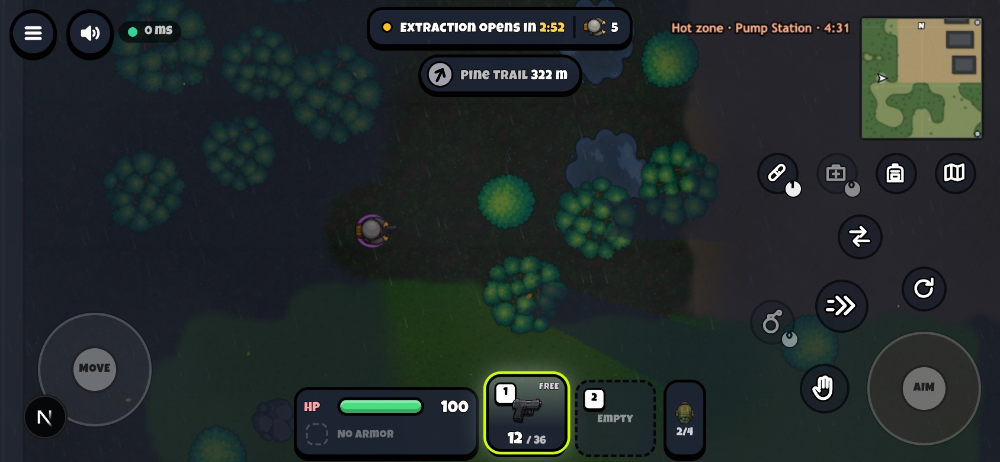
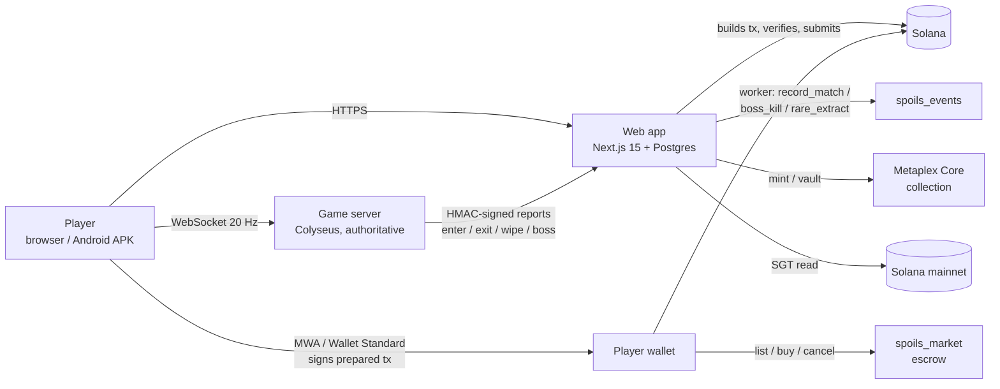

<p align="center">
  
</p>

<p align="center">
  <b>A persistent PvP extraction shooter. Loot, fight, get out before the wipe — and own what you carry out, on Solana.</b>
</p>

<p align="center">
  <a href="https://spoils.gg/play"><b>▶ Play now (browser, no wallet needed)</b></a> ·
  <a href="https://spoils.gg/onchain">On-chain items</a> ·
  <a href="https://spoils.gg/economy">On-chain game log</a> ·
  Demo video: <i>link coming</i> ·
  Pitch deck: <i>link coming</i>
</p>

<p align="center">
  Colosseum Crypto World's Fair · Superteam KZ × iDos Games Side Track · Solana Mobile CLOCK IN
</p>



## Contents

- [The problem](#the-problem)
- [What SPOILS is](#what-spoils-is)
- [Solana integration](#solana-integration)
- [Deployed addresses](#deployed-addresses)
- [Architecture](#architecture)
- [Try it](#try-it)
- [Run locally](#run-locally)
- [Repository map](#repository-map)
- [Status and roadmap](#status-and-roadmap)
- [Team](#team)

## The problem

Extraction shooters (Escape from Tarkov, Arena Breakout, Dark and Darker) are one of the strongest loops in games:
the gear you risk is the gear you earned, so every raid matters. But they all share two flaws:

1. **The loot is not yours.** Years of play live in a publisher's database. Real-money trading happens anyway,
   on grey markets full of scams, and the studio fights its own players over it.
2. **They do not fit a phone or a short break.** Matchmaking queues, 40-minute raids and desktop controls.

## What SPOILS is

A cartoon top-down extraction shooter where **one map is always live**. The world wipes every 45 minutes on a UTC
clock — 32 maps a day. No matchmaking: you drop in whenever entry is open, loot containers, fight other players and
NPC guards, and extract at least three minutes after you entered. Anyone still on the map at the wipe goes
**missing in action** and loses everything they carried. Every third map is a boss event.

- **Sessions of 3–10 minutes**, built for a phone and a coffee break; the wipe clock pulls you back.
- **Humans only.** No player-like bots; NPCs are boss guards and map wardens.
- **A closed economy.** Lost gear goes into a "pool of the lost" that feeds the next maps — nothing is printed for
  money.
- **Mobile-first.** Landscape touch HUD (move stick, aim stick, action cluster around the thumb), phone inventory,
  haptics, client-side shot prediction. Measured on a Solana Seeker: 109 FPS, touch-to-frame 7 ms.
- Authoritative 20 Hz multiplayer server, XP, levels, quests, friends, parties, leaderboards, an alpha pass.

| Raid | Boss event | Phone HUD |
|---|---|---|
|  |  |  |

## Solana integration

The design rule: **the game plays without a wallet; Solana is where the stakes become real.** A new player signs up
with a nickname and is in a raid in seconds. Once they extract something worth keeping, Solana takes over: ownership,
trading and a public record of the world.

### 1. Gear you extract becomes an asset you own — Metaplex Core

Epic and legendary gear can leave the game as a **Metaplex Core asset** in the player's own wallet (collection
`GpKomK…kDBhX`).

- **Send to wallet** — the server mints the item into the linked wallet the first time, and later moves the same
  asset out of the game vault. The server signs and pays the fee; the item turns `onchain` in the game and cannot
  be used in raids while it is outside.
- **Bring it back** — the wallet sends the asset to the game vault; after confirmation the item lands in the
  importer's stash, **whoever minted it**. Buy a gun from a stranger on chain, carry it into the next raid.
- **Live metadata** — `/api/onchain/meta/<item>` serves the asset's JSON with the item's current durability from
  the game, so a worn gun looks worn in any wallet or marketplace.

Code: [`apps/web/src/lib/onchain`](apps/web/src/lib/onchain).

### 2. A trustless SOL market — our Anchor program `spoils_market`

Players trade gear for SOL **without trusting the game** ([`programs/spoils-market`](programs/spoils-market/src/lib.rs),
Anchor 0.32):

| Instruction | What it does |
|---|---|
| `list(price_lamports)` | moves the asset from the seller into an escrow PDA (one per asset) at a fixed price |
| `buy` | in one atomic transaction pays the seller, sends the 5 % fee to the treasury and hands the asset to the buyer |
| `cancel` | returns the asset to the seller |
| `initialize` / `update_config` | collection, treasury, fee (upgrade authority only) |

The program checks that the asset belongs to the SPOILS collection (`check_asset`), so nothing else can be listed.
The game never holds a seller's SOL or a listed item. Everyday trades inside the game use soft credits; SOL trades
go only through this escrow.

### 3. A public record of the world — our Anchor program `spoils_events`

Every settled map, boss kill and rare extract is written to Solana by
[`programs/spoils-events`](programs/spoils-events/src/lib.rs). Each record is one instruction that checks the
signer, bumps a counter in the Config PDA and emits an event — **no account per event, no rent, only the fee**.

| Instruction | When | Data on chain |
|---|---|---|
| `record_match` | a map shard is settled at the wipe | cycle id, shard, `match_hash` = sha256 of the canonical end report, humans, MIA count |
| `record_boss_kill` | the event boss dies | cycle id, boss kind, `killer_hash` |
| `record_rare_extract` | a player extracts an epic or legendary they did not bring in | cycle id, item type hash, rarity, `owner_hash` |

Anyone can check that a reported match result matches its on-chain hash. `/economy` lists the records with
explorer links. Privacy: no ids, nicknames or emails go on chain — only salted hashes, and the two hashes of one
player differ on purpose so a public boss-kill nickname cannot be tied to rare extracts.

Delivery is built to survive a bad RPC: settlement queues the event in the same database transaction (a savepoint,
so chain trouble never breaks a raid); a worker sends batches every minute with exponential back-off, stores the
signature **before** sending (a retry checks whether the earlier transaction landed instead of recording twice),
and checks the program, the Config and the signer's balance before each pass. Code:
[`apps/web/src/lib/chain`](apps/web/src/lib/chain).

### 4. Wallets: Sign-In with Solana and Mobile Wallet Adapter

- **SIWS** links a self-custody wallet to the account: a single-use server nonce, the signed message verified on the
  server, the domain pinned. Code: [`apps/web/src/lib/wallet`](apps/web/src/lib/wallet).
- **Mobile Wallet Adapter** — `@solana-mobile/wallet-standard-mobile` registers MWA as a Wallet Standard wallet;
  the Android APK is built with Solana Mobile's `webshell`, so wallet intents go straight to the wallet app (Seed
  Vault on Seeker, Phantom, Solflare).
- **Every player-signed transaction is built by the server** (fee payer = the player's wallet) and its message is
  stored; `/api/onchain/submit` accepts only that exact message with valid signatures, sends it, waits for
  confirmation and applies the game effect exactly once. Unconfirmed ops are settled later (landed → done,
  blockhash expired → rolled back).
- **Starter kit for SOL** — a plain SOL transfer to the treasury with a `spoils:kit:<op>` memo; the kit is granted
  after confirmation.

### 5. Seeker Genesis Token perk (mainnet read)

The game reads the linked wallet on **mainnet** for a Seeker Genesis Token (a Token-2022 member of the SGT group)
and gives Seeker owners a cosmetic badge in the lobby, party and leaderboards plus a one-time Genesis frame. One
claim per SGT mint (an SGT moved to another wallet cannot claim again); cosmetic only, no gameplay advantage. Code:
[`apps/web/src/lib/seeker`](apps/web/src/lib/seeker).

### 6. The SPOILS token — iDos Games edition

For the Superteam KZ × iDos Games side track, a separate build of the same game runs on
[iDos Games](https://idosgames.com) (Title `8YECHSD4`) with its own Solana token **SPOILS**
(mainnet mint `2jWPc277xY4HQSnqNBJK9Md6YGaxQBwas3ofjJURidos`). The player signs in with the iDos account (SSO,
ticket verified server-side); the edition spends SPOILS through the iDos store on crates whose contents come only
from the pool of the lost — the token never prints items. Prices are set in cents and converted at the live Jupiter
rate. Design: [`docs/IDOS_TOKEN_ECONOMY.md`](docs/IDOS_TOKEN_ECONOMY.md), code:
[`apps/web/src/lib/idos`](apps/web/src/lib/idos), shell: [`deploy/idos-shell`](deploy/idos-shell).

### Why Solana

- **Fees and speed fit a game.** One record per map shard, 32 maps a day, plus mints and trades — a fraction of a
  cent each, confirmed in seconds. The server pays every write a player does not sign.
- **Metaplex Core** gives cheap single-account assets with plugins — the right shape for thousands of guns.
- **Composable ownership.** A SPOILS gun is an asset any Solana wallet, explorer or marketplace understands; the
  escrow is a program anyone can read, not a promise in our terms of service.
- **Solana Mobile.** MWA, Seed Vault and the Seeker Genesis Token make a phone-first game with real wallets possible
  without a custom app store or a custodial wallet.

## Deployed addresses

Devnet (live, used by [spoils.gg](https://spoils.gg)):

| What | Address |
|---|---|
| `spoils_market` program | [`3eu7K4GkLw1CA74Z4JSadBjsxZHNpaauWTtky6u52eGB`](https://explorer.solana.com/address/3eu7K4GkLw1CA74Z4JSadBjsxZHNpaauWTtky6u52eGB?cluster=devnet) |
| `spoils_events` program | [`8Jc6sbbLY7PoJ2wms33k9MzYmMBdidH96vX4nLFbqf9B`](https://explorer.solana.com/address/8Jc6sbbLY7PoJ2wms33k9MzYmMBdidH96vX4nLFbqf9B?cluster=devnet) |
| `spoils_events` Config PDA | [`4K8fSU19yNccXzNuUBPWyx6EXdnBrJgndnfjt3rfcgjY`](https://explorer.solana.com/address/4K8fSU19yNccXzNuUBPWyx6EXdnBrJgndnfjt3rfcgjY?cluster=devnet) |
| Metaplex Core collection | [`GpKomKhahD93PDJB9jhz6v32Y8oMgVKcjrBWXu2kDBhX`](https://explorer.solana.com/address/GpKomKhahD93PDJB9jhz6v32Y8oMgVKcjrBWXu2kDBhX?cluster=devnet) |
| Server authority (record signer, mint payer, vault, treasury) | [`AHgxhkN5Qu9T9nuV5yBaSU2oR6Xk7XA1QkrYRcUiPgNN`](https://explorer.solana.com/address/AHgxhkN5Qu9T9nuV5yBaSU2oR6Xk7XA1QkrYRcUiPgNN?cluster=devnet) |

Mainnet:

| What | Address |
|---|---|
| SPOILS token (iDos edition) | [`2jWPc277xY4HQSnqNBJK9Md6YGaxQBwas3ofjJURidos`](https://explorer.solana.com/address/2jWPc277xY4HQSnqNBJK9Md6YGaxQBwas3ofjJURidos) |
| Seeker Genesis Token check | read-only, no program of ours |

IDLs: [`programs/idl`](programs/idl).

## Architecture



- **Game server** (`apps/game-server`) runs the always-live world: opens each 45-minute map (a new one 30 s before
  the wipe), simulates combat, NPCs and loot, and reports results to the web over HMAC-signed calls. It never sees
  wallet keys.
- **Web** (`apps/web`) owns accounts, stash, gear, economy, settlement and everything on chain. The battle client is
  PixiJS.
- **Shared contract** (`packages/shared`) — constants, economy, protocol and state schema used by both sides.

## Try it

1. Open **[spoils.gg/play](https://spoils.gg/play)** — play as a guest or register a nickname. No wallet needed to
   play.
2. Drop into the live map, loot, and stand in an extract zone at least 3 minutes after entering.
3. To see Solana: link a devnet wallet (Phantom / Solflare set to devnet) on [/onchain](https://spoils.gg/onchain),
   send an epic or legendary item to it, list it for SOL, buy it from a second wallet, bring it back into the game.
4. [/economy](https://spoils.gg/economy) shows the on-chain record of maps, boss kills and rare extracts with
   explorer links.

Android: the APK (Solana Mobile `webshell`, tested on a Seeker) — link on the submission page.

## Run locally

Needs Node 20+, pnpm 10, Postgres. Anchor 0.32 and the Solana CLI only for the programs.

```bash
pnpm install
cp .env.example .env      # fill DATABASE_URL, SESSION_SECRET, GAME_SERVER_HMAC_SECRET
createdb extract
pnpm db:push
pnpm dev                  # web on :3001 + game server
```

Without `WEB_API_BASE_URL` / `GAME_SERVER_HMAC_SECRET` outside production the game server lets everyone in with a free
kit and settles nothing — enough to try the combat. On-chain features need the env block "On-chain game results" and
`ONCHAIN_COLLECTION` from `.env.example`.

Programs and tests:

```bash
cd programs
anchor build                                  # spoils_events + spoils_market
cargo test -p spoils-events -p spoils-market  # Rust unit tests
cd ..
pnpm shared:build && pnpm typecheck
T=apps/game-server/node_modules/.bin/tsx
$T --test apps/web/src/lib/chain/queue.test.ts        # on-chain event queue
$T --test apps/web/src/lib/onchain/onchain.test.ts    # items, escrow flow, submit guard
$T programs/scripts/onchain-admin.ts e2e GpKomKhahD93PDJB9jhz6v32Y8oMgVKcjrBWXu2kDBhX   # full flow against devnet
```

Deploy, env, admin and the operator commands: [`docs/OPERATIONS.md`](docs/OPERATIONS.md).

## Repository map

| Path | What |
|---|---|
| [`programs/spoils-market`](programs/spoils-market) | Anchor program: SOL escrow market for SPOILS Core assets |
| [`programs/spoils-events`](programs/spoils-events) | Anchor program: on-chain record of maps, boss kills, rare extracts |
| [`programs/scripts`](programs/scripts) | devnet deploy, admin, smoke and e2e scripts |
| [`apps/web/src/lib/onchain`](apps/web/src/lib/onchain) | mint / export / import, market transactions, submit guard |
| [`apps/web/src/lib/chain`](apps/web/src/lib/chain) | event queue and worker for `spoils_events` |
| [`apps/web/src/lib/wallet`](apps/web/src/lib/wallet) | Sign-In with Solana, wallet link |
| [`apps/web/src/lib/seeker`](apps/web/src/lib/seeker) | Seeker Genesis Token check and perk |
| [`apps/web/src/lib/idos`](apps/web/src/lib/idos) | iDos edition: SSO bridge, SPOILS token shop |
| [`apps/game-server`](apps/game-server) | Colyseus authoritative server, world clock, simulation |
| [`apps/web`](apps/web) | Next.js site, settlement, economy, PixiJS battle client |
| [`packages/shared`](packages/shared) | shared constants, economy, protocol |
| [`webshell`](webshell), [`twa`](twa) | Android wrappers (Solana Mobile webshell — primary for MWA; Bubblewrap TWA) |
| [`deploy`](deploy) | docker compose, nginx, cron, iDos shell |
| [`docs`](docs) | game design, alpha plan, security audit, scaling (mostly in Russian) |

## Tech stack

TypeScript · Next.js 15 · PixiJS · Colyseus 0.16 · Postgres + drizzle · Anchor 0.32 (Rust) · Metaplex Core ·
`@solana/web3.js` · Solana Mobile Wallet Adapter + webshell · iDos Games SDK (`@idosgames/core`) · Docker.

## Status and roadmap

Built during the hackathon: first commit 2 October 2026. Live today at spoils.gg on **devnet**:

- [x] Always-live world with 45-minute wipes, boss events, XP, quests, parties, leaderboards
- [x] Mobile touch controls and Android APK (tested on Solana Seeker)
- [x] Both Anchor programs deployed; on-chain records written by the live server
- [x] Core items: send to wallet, SOL escrow market, bring back into the game
- [x] SIWS + MWA, Seeker Genesis Token perk
- [x] iDos edition with the SPOILS token
- [ ] Open alpha with real players, balance from live data
- [ ] Security review of both programs, then mainnet
- [ ] Solana dApp Store release
- [ ] Seasons with on-chain leaderboards and rewards

## Team

**Vlad** ([@Vlad0n1m](https://github.com/Vlad0n1m)) — solo builder: game design, code, art direction, working with AI
coding agents. No VC or angel funding.
